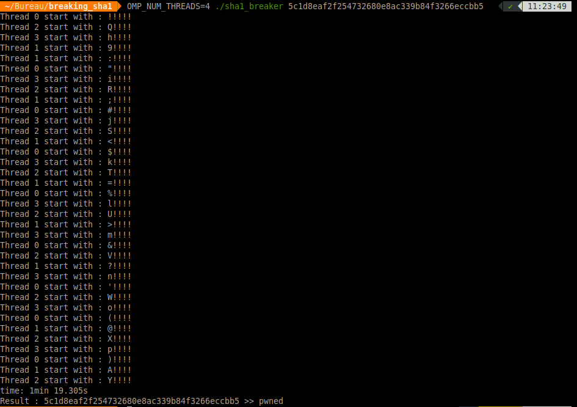

# Breaking simples SHA1

This program takes a SHA1 hash and tries to break it.

I made it for fun, and for entertainment with mutliprocessing programming using OpenMP, so do not expect high performances.

## Constraints

Plain text must be 5 digits long, with ASCII characters from 0x21 (!) to 0x7E (~).

For testing, you can increase SIZE_KEY from 5 to 6 if you want to try six digits long plain texts.


## Compile
Linux / windows
```
gcc sha1_breaker.c -o sha1_breaker -lssl -lcrypto -lm -fopenmp
```
MAC OS X 
```
clang sha1_breaker.c -o sha1_breaker -L/usr/local/opt/llvm/lib -I/usr/local/opt/llvm/include -lomp -Xpreprocessor -fopenmp -lm -L/usr/local/opt/openssl/lib -I/usr/local/opt/openssl/include -lcrypto -lssl
```

## Run
```
OMP_NUM_THREADS=4 ./sha1_breaker
```

## Results / duration

Depending on the CPU, I tried with 4 and 6 threads, the optimum remaining when the number of requiered threads is equal to the number of CPU cores.

For 5 digits long plain text, the average breaking time is a few minutes.
For 6 digits long plain test, you will have to expect one hour and half.

## Example



## To conclude

Wisely chose your hash algorithm.
Do not use too short passwords.
Salt your hashes to prevent rainbow tables.
(Even if a short plaintext and a known salt doesn't change so much things for bruteforcing).